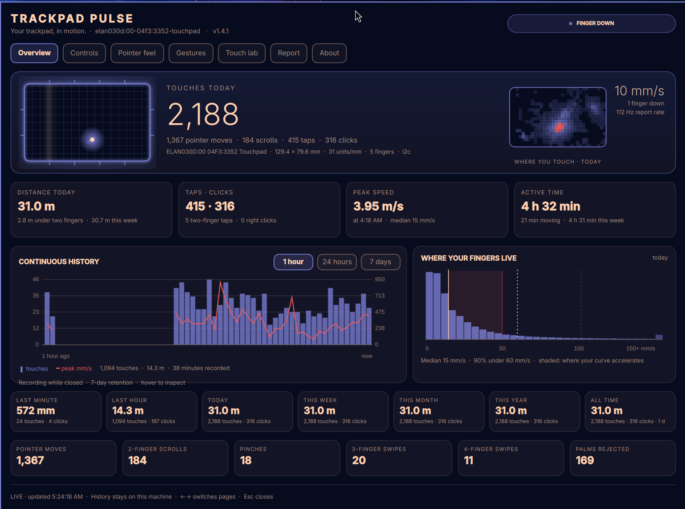
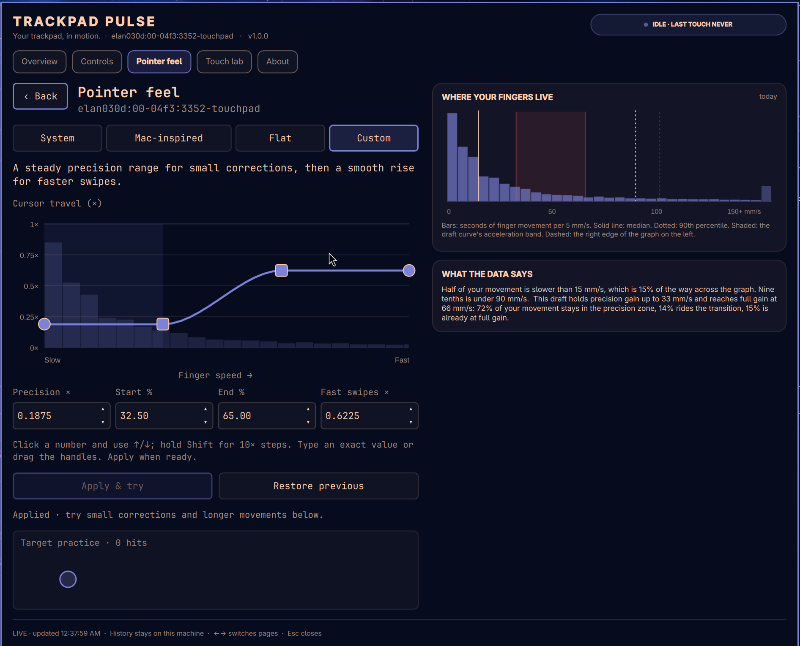
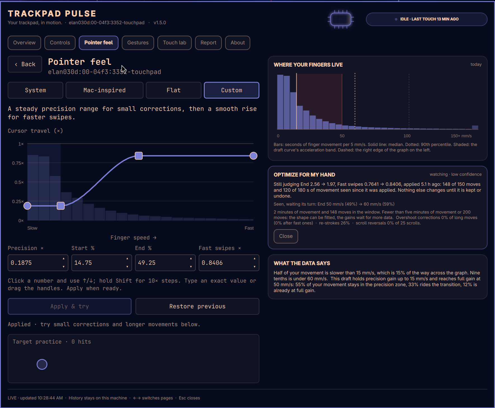
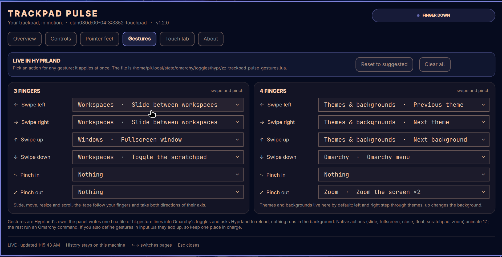
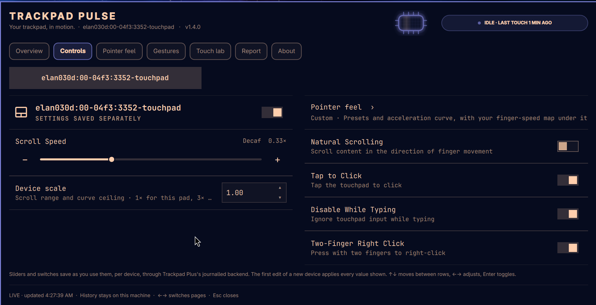
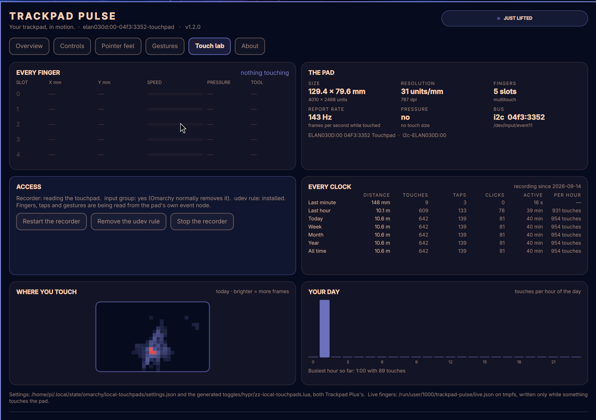

<div align="center">



# Trackpad Pulse

**Your trackpad, in motion.**

A live trackpad on the Omarchy bar that lights where your fingers are, and behind it every number the pad can give you: touches, taps, scrolls, swipes, pinches, rejected palms, distance, speed, a week of history, and a finger-speed map drawn under the pointer acceleration curve so you can tune the curve against the hand that drives it.

## [nixfred.com](https://nixfred.com)

[](https://nixfred.com)
[](https://omarchy.nixfred.com)

[](CHANGELOG.md)
[](https://omarchy.org)
[](https://quickshell.org)
[](LICENSE)

</div>

---

## The idea

Every trackpad settings panel asks you to guess. How fast do your fingers actually move? Is the acceleration curve's *Start* somewhere your hand ever goes? Did the palm rejection fire, or did the cursor jump on its own?

Trackpad Pulse stops guessing. A small recorder reads the pad's own event stream and keeps seven days of what your fingers did. The bar icon is the pad itself: it lights where your fingers are, ripples on a tap, dims when you switch the pad off. The dashboard puts the numbers beside the controls, and the pointer-feel editor draws the distribution of your finger speed under the curve it edits.

The controls and the curve editor are **Trackpad Plus** by David Fano, kept whole. Trackpad Pulse is the instrument built around them.

---

## The icon

The bar entry is one glyph, no number. It is the trackpad: a glowing outline with a sensor grid, a scan line while it is idle, and a bright dot for every finger on the pad, trailing as it moves and rippling when it taps. Right-click switches the pad off and on.

---

## Overview

Today, at a glance:

- **Touches, taps, clicks, pointer moves, two-finger scrolls, pinches, three- and four-finger swipes, and palms the firmware rejected.**
- **Distance** your fingers travelled, in millimetres and metres, and how much of it was under two fingers.
- **Peak speed** and when it happened, beside the median.
- **Active time** and how much of it was actually moving.
- **Continuous history**: touches per minute as bars, peak speed as a line, over one hour, a day or a week. Recorded while the panel is closed.
- **Where your fingers live**: seconds of movement per 5 mm/s bin, with the median and 90th percentile marked and the active curve's acceleration band shaded.

---

## Pointer feel, with the data under the curve

<div align="center">

</div>

libinput's custom acceleration profile takes device speed in units per millisecond on its x axis. Touchpad motion is normalized to 1000 dpi, so one unit per millisecond is 25.4 mm/s and the editor's graph spans roughly 0 to 100 mm/s of finger speed. That is a physical axis, and Trackpad Pulse has your finger speeds on it.

So the editor draws the recorded distribution as bars under the curve, and the panel says what it means in words: *half of your movement is slower than 15 mm/s; this draft holds precision gain up to 33 mm/s and reaches full gain at 66 mm/s; 72% of your movement stays in the precision zone, 14% rides the transition, 15% is already at full gain.* Drag a handle and the sentence updates. Apply when the shape matches your hand.

Everything else on this page is David Fano's editor exactly as he built it: System, Mac-inspired, Flat and Custom profiles, four draggable handles with spinners, keyboard steps, target practice, Apply & try, and Restore previous.

### Optimize for my hand

<div align="center">

</div>

A wrong curve leaves fingerprints, and the recorder reads them. A long move answered at once by a short move back the other way is an **overshoot correction**: the cursor went too far at that speed. A long move continued at once in the same direction is a **re-stroke**: the pad ran out before the cursor arrived. Two-finger scrolls have the same two tells.

Press **Optimize for my hand** and the recorder reads the week since your last applied pass and proposes:

- **Start** at the speed below which 45% of your movement happens, **End** at the 90th percentile. The shape of the curve fitted to the shape of your hand.
- **Fast swipes** down 8% when more than a fifth of your fast moves end in an overshoot, or up 10% when more than an eighth of your long moves are re-strokes. **Precision** down 8% when slow moves keep overshooting. **Scroll speed** the same way from reversals and repeats.

**One change a pass.** The proposal is a single change: the bigger miss of Start and End first, then Fast swipes, Precision, Scroll speed. Everything else the data would change is listed as *seen, waiting its turn*. The only exception is the first fit of a System or Flat profile, which sets the profile, Start and End together, because a custom curve cannot exist with only one of them.

**The next pass decides whether to keep it.** Every applied change is logged with what the next pass will watch. A nudge must earn its keep: the rate it targeted has to fall. A shape change is kept unless overshoot corrections or re-strokes rise. Either is undone when the opposite fingerprint appears. The pass waits for 150 moves and three minutes of movement before judging, proposes nothing new while it waits, and writes the verdict and its reason into the log once. When the verdict is undo, the proposal is the undo itself, carrying that reason, behind **Undo it**; **Keep it anyway** logs your disagreement and the loop moves on. An undone change is held until as many moves ask for it again, and a value you changed by hand in the meantime is left alone.

Every change comes with its reason and the numbers behind it. Nothing changes until you press **Apply this**, which goes through Trackpad Plus's journalled path, so **Restore previous** still undoes it. Thin data fits the shape and withholds the gains, and says so.

It cannot tune taps, natural scrolling or the right-click switch; those are preferences with no signal in the touch stream.

**It keeps watching.** Every ten minutes the recorder re-runs the same optimizer against the settings you actually have. When a proposal with real changes and at least medium confidence turns up that you have not seen, the Optimize button and the Pointer feel tab light up and the Overview carries a one-line banner with **Review** and **Later**. Nothing is applied for you.

---

## Gestures

<div align="center">

</div>

Every three- and four-finger swipe and pinch Hyprland offers, each with a searchable dropdown of 56 actions grouped by what they do:

| Group | Actions |
|---|---|
| **Workspaces** | slide between workspaces (1:1, animated), next, previous, last used, scratchpad, layout toggle, scroll the tape |
| **Windows** | fullscreen, maximize, close, float, move, resize, focus left/right/up/down, gaps, transparency |
| **Themes & backgrounds** | next, previous, random and picked theme; next and picked background; night light |
| **Omarchy** | menu, emoji, clipboard, keybindings, screenshot region or screen, recording, lock, screensaver, bar, do not disturb, terminal, browser, files |
| **Media & audio** | volume up, down, mute, mic mute, switch output, brightness, play/pause and tracks where `playerctl` is installed |
| **Fullscreen apps** | the default terminal, or any installed app, opened as a fullscreen window |
| **Zoom** | cursor zoom ×2, or live with the pinch |
| **Trackpad Pulse** | open the dashboard, Optimize for my hand, trackpad off |

Pick an action and it is live at once: the panel sends slot and action ids to the recorder, the recorder writes one Lua file of `hl.gesture` lines into `~/.local/state/omarchy/toggles/hypr/` through Trackpad Plus's hardened writer, and asks Hyprland to reload. Actions that follow your fingers (slide, move, resize, scroll the tape) own both directions of their axis. The suggested set is shown first and only applied when you say so: three fingers slide workspaces, swipe up for fullscreen, down for the scratchpad; four fingers step through themes left and right, change the background up, open the menu down, and pinch out to zoom.

---

## Every clock

Distance travelled, touches, taps, clicks and active time over the trailing minute, the last hour, today, this week, this month, this year and all time. Seven cards on the Overview, the full table in the Touch lab with touches per hour of active use. Days are kept forever in a table of one row each, so "all time" means all time.

## Report

This week against last: distance, touches, clicks and active time, a bar per day, busiest day and hour, palms rejected, and every Optimize pass with what it changed, its verdict and the reason. Three readings only a week of data can give:

- **Your hand.** A right hand parks its thumb bottom-left and drops its heel bottom-right; a left hand mirrors it. The heatmap and the rejected palms vote, and the verdict comes with its reasons and a confidence.
- **Mouse vs trackpad.** Cursor motion with no finger on the pad is a mouse. The share of your active time on each, and an opt-in **auto-off**: after 15 seconds of mouse use the pad is switched off through Trackpad Plus's own per-device setting, and a tap or a real move on the pad switches it straight back on. The kernel keeps reporting the pad while Hyprland ignores it, which is what makes the way back possible.
- **Where you use it.** Every touch is stamped with the focused window, so the week's top windows by touches and distance are on the page.

## Where you touch

The Touch lab draws a heatmap of where your fingers land on the pad, per day, at the pad's real proportions, beside a bar for every hour of the day. A thumb parked in a corner, a palm zone the firmware keeps rejecting, the hour you actually work: all visible.

---

## Controls

<div align="center">

</div>

Trackpad Plus's per-device controls, laid out in two columns so nothing scrolls: enable or disable the selected pad, scroll speed (0.01–1.00) with a per-device scale, pointer speed for the System and Flat profiles, and the natural scrolling, tap to click, disable-while-typing and two-finger right-click switches. Every change is scoped to one device, debounced, journalled, and rolled back if the compositor refuses it. See [Trackpad Plus](https://github.com/davefano/omarchy-trackpad-plus) for the full account of device scale, Apple and Dell groups, and migration from the original widget.

---

## Touch lab

<div align="center">

</div>

- **Every finger**: slot, position in millimetres, speed, pressure where the pad reports it, and whether the firmware called it a palm, live.
- **The pad**: physical size, units per millimetre and dpi, finger slots, report rate in frames per second, pressure and touch-size support, bus and node.
- **Access**: what the recorder can read and why, with buttons to start or stop it and to grant or revoke touchpad access.
- **This week**: totals and the peak.

---

## Access: how the recorder reads the pad

Omarchy deliberately removes users from the `input` group, because membership lets any process read every keyboard. Trackpad Pulse respects that. The recorder opens the touchpad's event node only if your user already may; otherwise it falls back to **cursor-only** telemetry from the compositor (distance and speed in pixels, no fingers) and says so.

To read fingers on a stock Omarchy install, the Overview and the Touch lab offer **Grant touchpad access**. It installs, through one polkit prompt, a two-line udev rule:

```
# Trackpad Pulse: let the active seat read its own touchpad. Keyboards stay root:input.
SUBSYSTEM=="input", ENV{ID_INPUT_TOUCHPAD}=="1", TAG+="uaccess"
```

`uaccess` is the same mechanism that lets your session use its own sound card and webcam: logind grants the logged-in seat an ACL on that node and takes it back when the seat changes. It applies to touchpads only. **Remove the udev rule** takes it out again and strips the ACL. The rule text is a constant in [collectors/trackpad_pulse.py](collectors/trackpad_pulse.py); print it with `python3 collectors/trackpad_pulse.py udev-rule`.

Nothing leaves the machine. History lives in `~/.local/state/trackpad-pulse/`, the live finger file in `$XDG_RUNTIME_DIR/trackpad-pulse/` on tmpfs, written only while something touches the pad. The recorder never writes input, never touches settings, never runs as root.

---

## Install

```sh
omarchy plugin add https://github.com/nixfred/trackpad.pulse.git --enable
```

The widget appears on the right of the bar as soon as a trackpad is detected. Open it: the Overview offers **Start the recorder**, which installs and enables `trackpad-pulse.service` in your user scope. Or install everything in one go from a checkout:

```sh
git clone https://github.com/nixfred/trackpad.pulse.git
cd trackpad.pulse
python3 install.py
```

`install.py` publishes the plugin, starts the recorder, places the widget through the running shell, and disables Trackpad Plus and the original touchpad widget if they are enabled, without deleting them. All three read and write the same settings files, so your per-device values carry over untouched.

Requires Omarchy's Quickshell shell and Lua-based Hyprland configuration (tested with Hyprland 0.56.2), Python 3, libinput with custom acceleration support (`libinput.so.10`), and GNU `timeout`. The recorder is Python 3 standard library only.

To update a git-managed install:

```sh
omarchy plugin update nixfred.trackpad-pulse
omarchy restart shell
```

---

## IPC

```sh
omarchy-shell nixfred.trackpad-pulse open        # the dashboard
omarchy-shell nixfred.trackpad-pulse close
omarchy-shell nixfred.trackpad-pulse toggle
omarchy-shell nixfred.trackpad-pulse chooser     # what right-click opens
omarchy-shell nixfred.trackpad-pulse page feel   # overview · controls · feel · lab · about
omarchy-shell nixfred.trackpad-pulse gestures    # the Gestures page
omarchy-shell nixfred.trackpad-pulse enable false  # the pad off; true puts it back
omarchy-shell nixfred.trackpad-pulse status      # JSON: device, access, today's counts, panel size
```

`enable` is the one to bind to a key if you type on an external keyboard with the laptop open.

---

## Files

| Path | What |
|---|---|
| `Panel.qml` | The bar entry and the five pages. Trackpad Plus's action queue and state logic, unchanged, host the telemetry pages. |
| `TrackpadChip.qml` | The glowing pad: fingers, trails, ripples, scan line. |
| `TouchHistoryGraph.qml`, `SpeedHistogram.qml` | The history and the speed distribution. |
| `CurveEditor.qml`, `Curve.js` | David Fano's acceleration editor, plus the histogram drawn under the curve. |
| `trackpads.py`, `Model.js`, `touchpad-state`, `touchpad-sensitivity` | Trackpad Plus's backend and helpers, unchanged. |
| `collectors/trackpad_pulse.py` | The recorder and its actions. `collectors/trackpad-pulse.service` is its unit. |
| `Pulse.js` | Formatting and readouts for the dashboard. |
| `install.py` | The one-shot installer. |

Settings stay where Trackpad Plus keeps them: `~/.local/state/omarchy/local-touchpads/settings.json` and the generated `toggles/hypr/zz-local-touchpads.lua`. Removing the plugin (`omarchy plugin remove nixfred.trackpad-pulse`) keeps them, and keeps the recorder's history; `python3 collectors/trackpad_pulse.py uninstall-service` stops the recorder.

---

## Development and testing

See [DEVELOPMENT.md](DEVELOPMENT.md) for the suite: the recorder's classifier is tested against synthetic evdev frames, the panel's queue logic under node, the curve editor under qmltestrunner, the IPC handler in an isolated offscreen shell, and the backend against a fake compositor. Trackpad Plus's [release safety review](docs/safety-review.md) still applies to everything it covers.

---

## Lineage

Trackpad Pulse is built on [Trackpad Plus](https://github.com/davefano/omarchy-trackpad-plus) by David Fano, which began as [omarchy-touchpad-widget](https://github.com/awkent01/omarchy-touchpad-widget) by Andrew Kent. Their commit history and copyright notices are preserved. [MIT](LICENSE).
